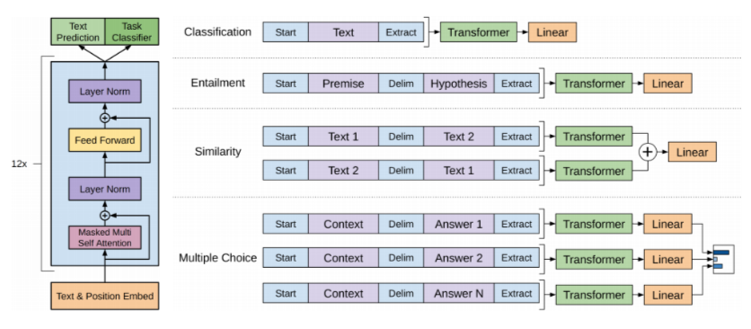
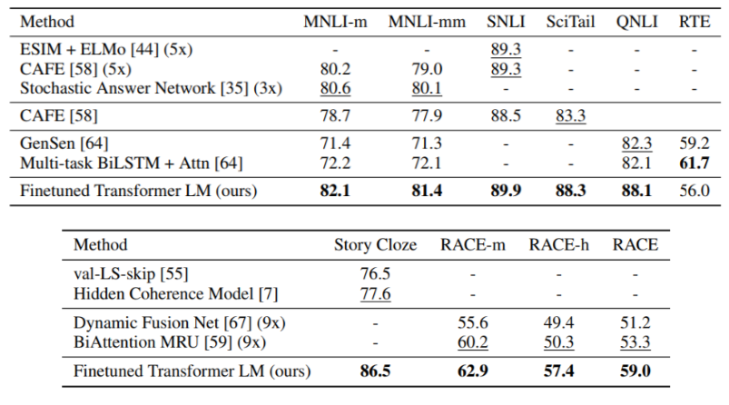
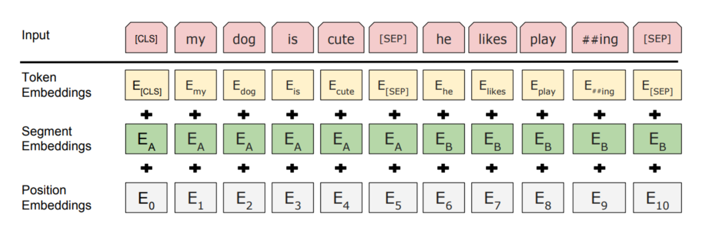
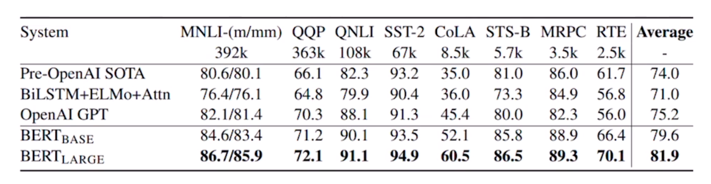
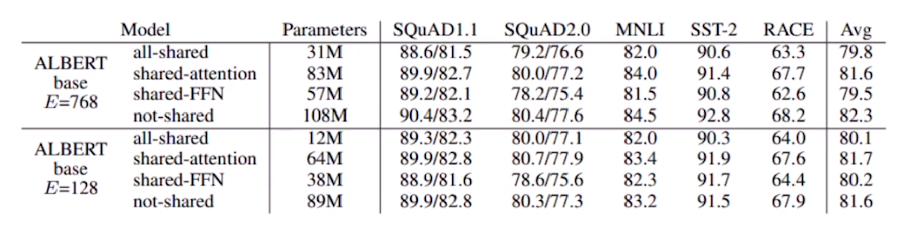
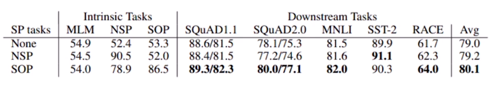
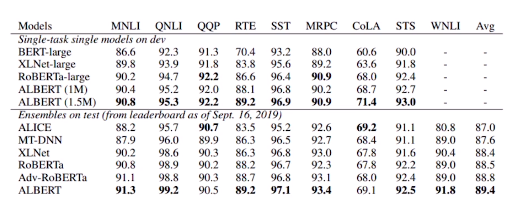
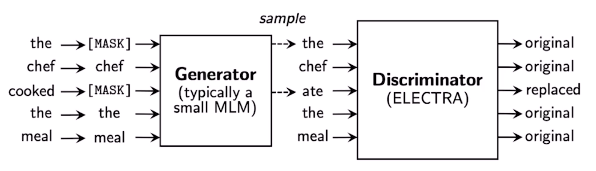

# Self-Supervised Pre-Training Models: GPT-1 & BERT

## recent trends
- transformer model and its selfattention block has become a general-purpose sequebce encoder and decoder in recent NLP applications as well as in other areas
- training deeply stacked transformer models via a self-supervised learning framework has significantly advanced vairous NLP tasks through transfer learning, e.g. BERT, GPT-3, XLNet, ALBERT, RoBERTa, Reformer, t5, ELECTRA...
- other applications are fast adopting the self-attention and transformer architecture as well as self-supervised approach, e.g. recommender systems, drug discovery, computer vision...
- as for natural generation, self-attention models still requires a greedy decoding of words one at a time

## GPT-1
- it introduces special tokens, such as \<S>, \<E>, $, to achieve effective transfer learning during fine-tuning
- it does not need to use additional task-specific architectures on top of transferred

- language understanding improved by generative pre-training

## BERT: pre-training of deep bidirectional transformers for language understanding
- learn through masked language modeling task
- use large-scale data and large-scale model

### Masked Language Model
- motivation
  - language models only use left context or right context, but language understand bi-directional
- if we use bi-directional language model?
  - problem: words can "see themselves" (cheating) in bi-directional encoder

### Pre-training Tasks in BERT
- masked language model(MLM)
  - mask some percentage of the input tokens at random, and then predict those masked tokens
  - 15% of the words to predict
    - 80% of the time, replace with [MASK]
    - 10% of the time, replace with a random word
    - 10% of the time, keep the sentence as same
- next sentence prediction(NSP)
  - predict whether sentence B is an actual sentence that proceeds sentence A, or a random sentence
- how to
  - mask out k% of the input words, and then predict the masked words
    - e.g. use k = 15%
- too little masking: too expensive to train
- too much masking: not enough to capture context
- problem
  - mask token never seen during fine-tuning
- solution
  - 15% of the words to predict, but do not replace with [MASK] 100% of the time. instead:
    - 80% of the time, replace with [MASK]
      - went to the store -> went to the [MASK]
    - 10% of the time, replace with a random word
      - went to the store -> went to the running
    - 10% of the time, keep the same sentence
      - went to the store -> went to the store
  
### Pre-training Tasks in BERT: Next Sentence Prediction
- to learn the relationships among sentences, predict whether sentence B is an actual sentence that proceeds sentence A, or a random sentence

### BERT Summary
1. Model Architecture
   - BERT BASE: L = 12, H = 768, A = 12
   - BERT LARGE: L = 24, H = 1024, A = 16
2. Input Recognition
   - WordPiece embeddings (30000 WordPiece)
   - Learned positional embedding
   - [CLS] - Classification embedding
   - Packed sentence embedding [SEP]
   - Segment embdding
    
3. Pre-Training Tasks
   - Masked LM
   - Next Sentence Prediction

## BERT vs CPT-1
- comparison of BERT and GPT-1
  - training-data size
    - GPT is trained on BookCorpus(800M words); BERT is trained on the BookCorpus and Wikipedia(2500M words)
  - training special tokens during training
    - BERT learns [SEP], [CLS], and sentence A/B embedding during pre-training
  - Batch size
    - BERT - 128,000 words ; GPT - 32,000 words
  - Task-specific fine-tuning
    - GPT uses the same learning rate of 5e-5 for all fine-tuning experiments ; BERT chooses a task-specific fine-tuning learning rate
  - GLUE Benchmark Results
    

# Advanced Self-Supervised Pre-Training Models: GPT-2, GPT-3, ALBERT, ELECTRA, Light-weight Models, Fusing Knowledge Graph into Language Model

## GPT-2: Language Models are Unsupervised Multi-task Learners
- just a really big transformer LM
- trained on 40GB of text
  - quite a bit of effort going into making sure the dataset is good quality
  - take webpages from reddit links with high karma
- language model can perform down-stream tasks in a zero-shot setting - without any parameter or architecture modification
- motivation:
  - The Natural Languages Decathlon: multi-task learning as QA
    - Bryan MCCann, Nitish Shirish Keskar, Caiming Xiong, Richard Socher
  - every NLP problem(task) can be transformed into the form of QA
- Datasets:
  - a promising source of diverse and nearly unlimited text is web scrape such as common crawl
    - they scraped all outbound links from Reddit, a social media platform, WebText
      - 45M links
        - scraped web pages which have been curated/filtered by humans
        - recieved at least 3 karma(up-vote)
    - 8M removed Wikipedia documents
    - use dragnet and newspaper to extract content from links
  - preprocess
    - BPE(byte pair encoding)
    - minimal fragmentation of words across multiple vocab tokens
  - modification
    - layer normalization was moved to the input of each sub-block, similar to a pre-activation residual network
    - additional later normalization was added after the final self-attention block
    - scaled the weights of residual layer at initialization by a factor of $\frac{1}{\sqrt{n}}$ where $n$ is the number of residual layer
  
## GPT-3: Language Models are Few-Shot Learners

- scaling up language models greatly improves task-agnostic, few-shot performance
- an autogressive language model with 175 billion parameters in the few-shot setting
- 96 attention layers, batch size of 3.2M(larger than GPT-2)
- prompt: the prefix given to the model
- zero-shot: predict the answer given only  a natural language description of the task
- one-shot: see a single example of the task in addition to the task description
- few-shot: see a few examples of the task
- Language Models are Few-Shot Learners
  - zero-shot performance improves stradily with model size
  - few-shot performance increases more rapidly

## ALBERT: A Lite BERT for Self-Supervised Learning of Language Representations
- is having better NLP models as easy as having models?
  - obstacles
    - memory limitation
    - training speed
  - solutions
    - factorized embedding parameterization
    - cross-layer parameter sharing
    - (for performance)sentence order prediction
- factorized embedding parameterization
  - V: vocab size, H: hidden-state dimension, E: word embedding dimension
  - in BERT, input is $V\times H$ matrix
  - in ALBERT, input is factorized as the multiplication of $V\times E$ matrix and $E\times H$ matrix
- cross-layer parameter sharing
  - shared-FFN: only sharing feed-forward network parameters across layers
  - shared-attetion: only sharing attention parameters across layers
  - all-shared: both of them
  - it works well
  
- sentence order prediction
  - next sentence prediction pretraining task in BERT is too easy
  - predict the ordering of two consecutive segments but with their order swapped
  
- GLUE results
  

## ELECTRA: Efficiently Learning an Encoder that Classifies Token Replacements Accurately
- Efficiently Learning an Encoder that Classifies Token Replacements Accurately
  - learn to distinguish real input tokens from plausible but synthetically generated replacements
  - pre-training text encoders as discriminators rather than generators
  - discriminator is the main networks for pre-training
  

