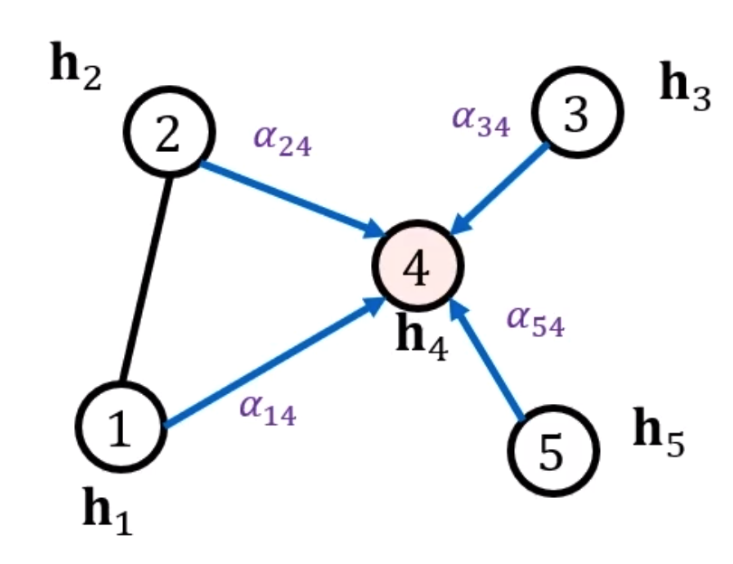
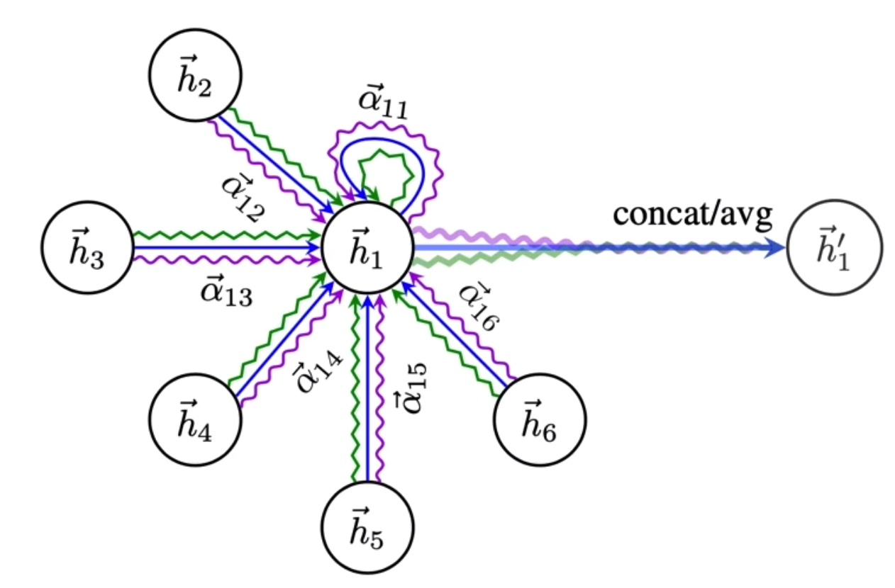
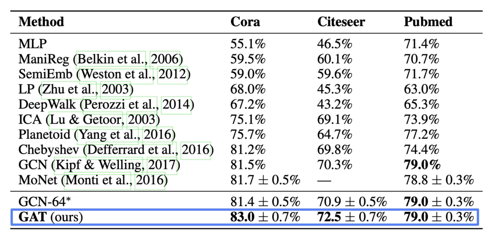
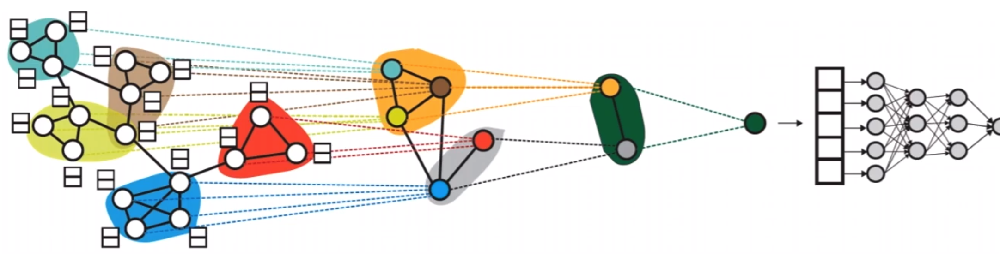
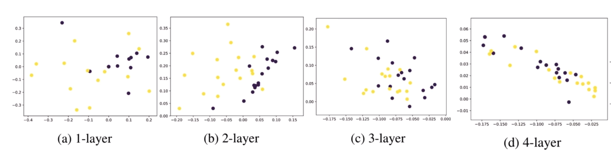
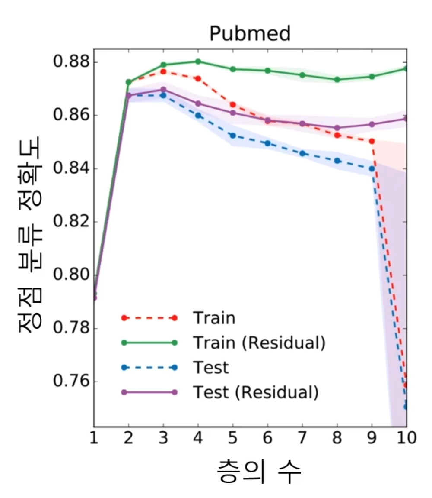
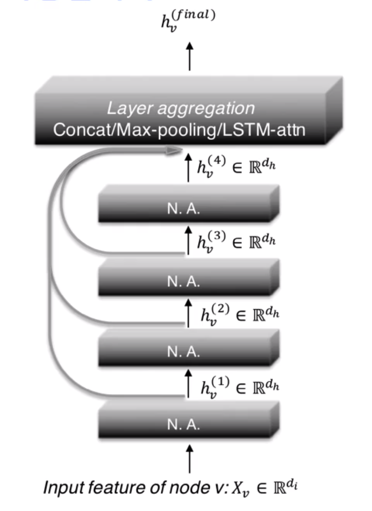
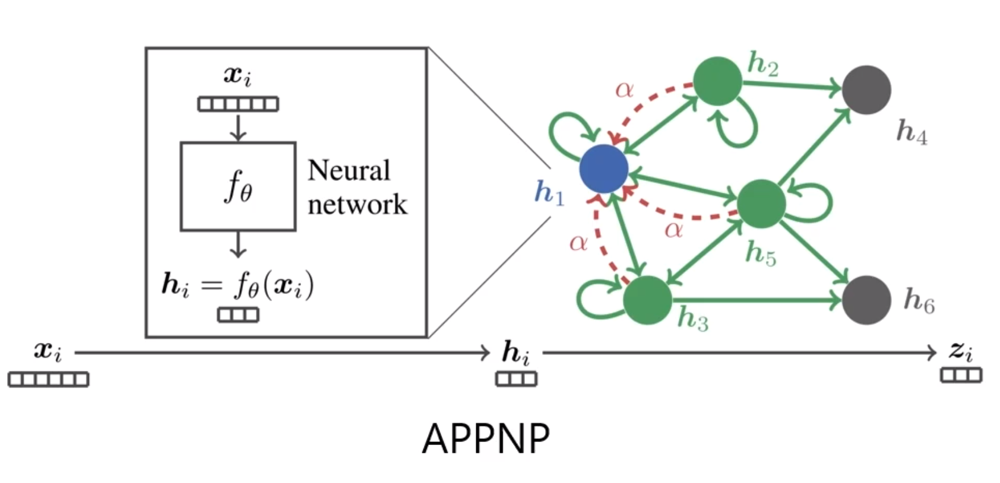
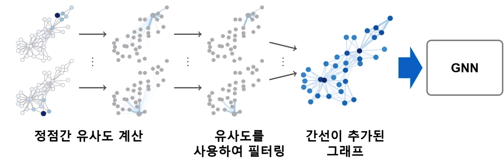
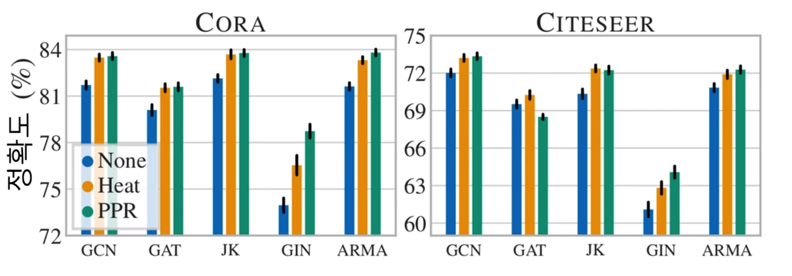

# Machine Learning Based on Graph: Graph Neural Network Advanced
## 1. Review on GCN
### 1.1. inductive node embedding
- inductive node embedding
  1. result is encoder
  2. once learning done, nodes added after can be embedded
  3. storage and pre-calculation is not required
  4. attributes of node can be used
- GNN is one of the most popular inductive node embeddings

### 1.2. structure of GNN
- repeating aggregation of neighbor's information, embedding is obtained
- types of GNN depend on aggregator used
- GNN can be applied to both unsupervised learning and supervised learning
  - in the case of unsupervised, preserve distance
  - in the case of supervised, use loss function of downstream task

### 1.3. application of GNN
- nodes that were not used during train, added after train or belong to a different graph can be embedded by GNN

## 2. Attention on GCN
### 2.1. limitation of basic GNN
- basic GNN aggregates the information of neighbor as usual mean
  $$
  h_v^k = \sigma(W_k\sum_{u\in N(v)}\frac{h_u^{k-1}}{|N(v)|}+B_kh_v^{k-1})
  $$
- GCN aggregates the information of neighbor as weighted mean considering connectivity
  $$
  h_v^k = \sigma(W_k\sum_{u\in N(v)\cup v}\frac{h_u^{k-1}}{\sqrt{|N(v)||N(u)|}})
  $$

### 2.2. graph attention neural network
- in GAT(Graph Attention Network), weight used for mean is also trainable parameter
- so GAT considers and measures the size of effect from neighbor
- to learn the weight, self-attention is used
- (self-attention)process to calculate $\alpha_{ij}$ which means the weight from node $i$ to node $j$
  1. $\tilde{h_i}=h_iW$
  2. $e_{ij}= a^T\left[ CONCAT(\tilde{h_i}, \tilde{h_j}) \right]$
  3. $\alpha_{ij} = softmax_j(e_{ij})=\frac{exp(e_{ij})}{\sum_{k\in \mathcal{N}_i}exp(e_{ik})}$
     
   where $a$ is called an attention coefficient which is trainable
- (multi-head attention)process to calculate
  $$
  h_i^{\prime} = \underset{1\leq k\leq K}{CONCAT}\sigma(\sum_{j\in \mathcal{N}_i}\alpha_{ij}^kh_jW_k)
  $$
  
- attention improves the result
  
## 3. Graph Embedding & Graph Pooling
### 3.1. graph embedding learning
- graph embedding is to represent graph as vectors
- node embedding represents only nodes as vectors
- graph embedding is utilized for classification
- ex. predict property of chemical compunds which are expressed as graph

### 3.2. graph pooling
- graph pooling is a process to obtain graph embedding from node embedding
- it is well-known that the method where structure of graph is considered shows higher performance in downstream task than a simple method using average
- differential pooling aggregates embedding hierarchically by cluster structure
  

## 4. Oversmoothing Problem
### 4.1. oversmoothing problem
- the increasing number of layers in GNN results in the phenomenon that embedding of node goes similar with other node's
- it is related with small world effect
  
- as a result of oversmoothing, the more layers are stacked the worse performance in downstream task is
- to solve this problem, we can consider residual but it works not that well
  $$
  h_u^{(l+1)} = h_u^{(l+1)}+h_u^{(l)}
  $$
  

### 4.2. breakthrough
- JK network(Jumping Knowledge Network)
- use not only the last layer of embedding but also other layers of embedding
  
- APPNP simplifies aggregator without neural network except 0-th layer
  

## 5. Data Augmentation of Graph
### 5.1. graph data augmentation
- data augmentation is useful in various problems of machine learning
- in graph, there might exist missing edges or unaccurate edges
- it can be overcome by augmentation
- proposal
  1. using random walk, get similarity
  2. add edges between pairs of nodes whose similarity is high
  

### 5.2. result of graph data augmentation
- as a result of graph data augmentation, performance in classification of node is improved
  

## 6. Practice