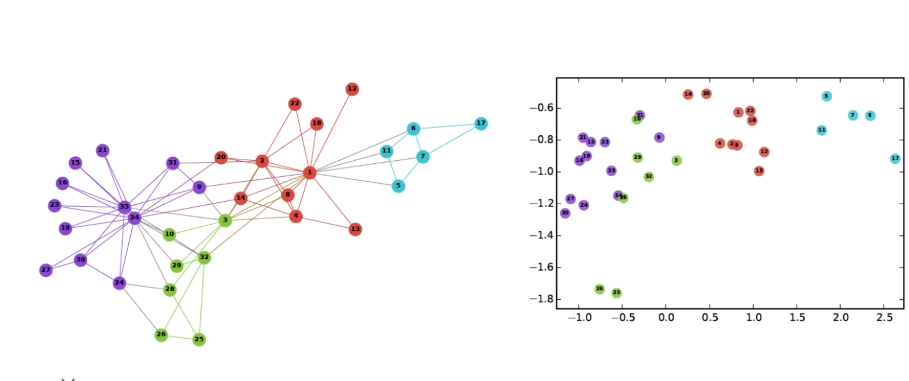
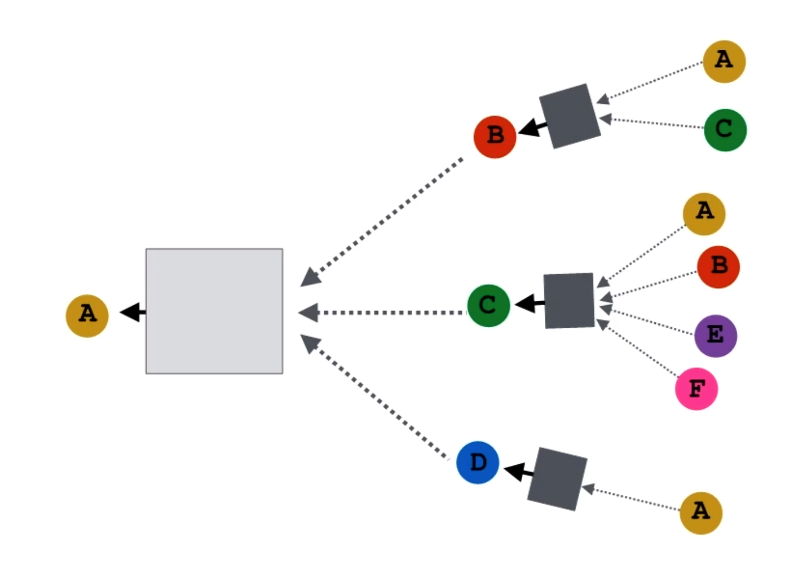
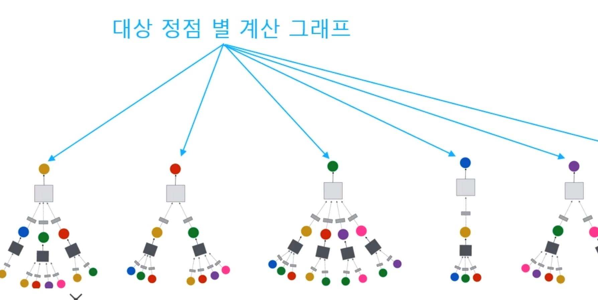
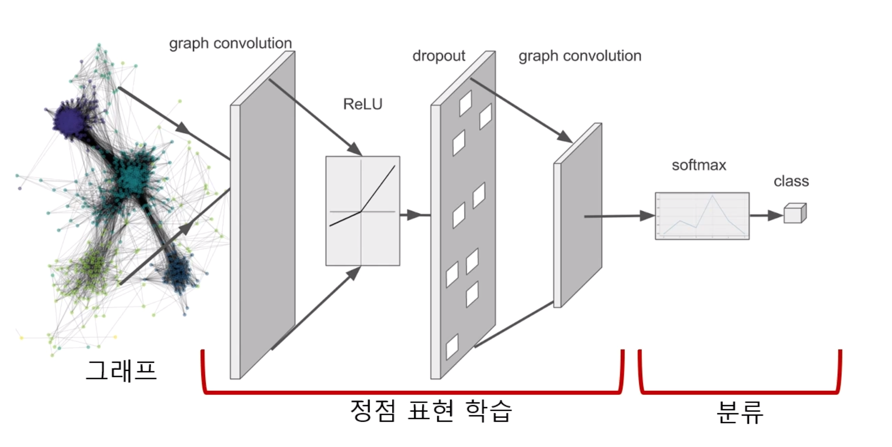
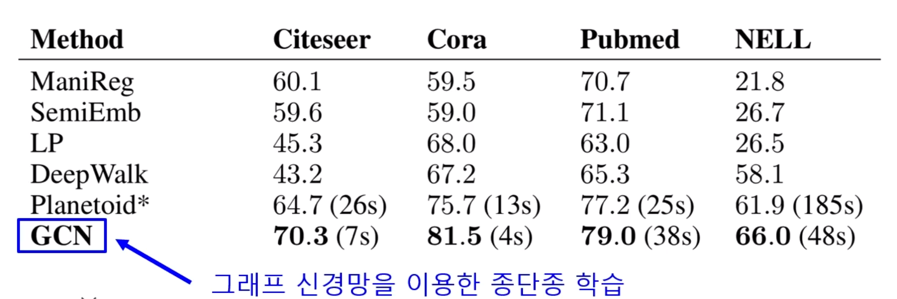
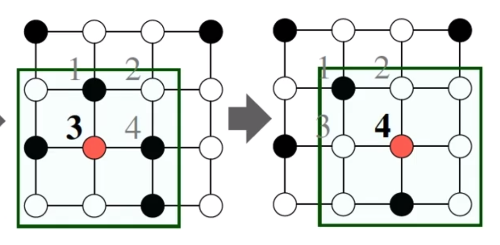

# Machine Learning Based on Graph: Graph Neural Network
## 1. Review on Node Embedding
### 1.1. node embedding learning
- node embedding
  - to represent nodes as vectors of vector space
  - for each node $u \in V(G)$, the embedding vector $z_u$ is a result of embedding
- the goal of node embedding is to preserve similarity of nodes
  
- the similarity of nodes embedded is defined by
  $$
  sim(u, v) \simeq z_v^Tz_u
  $$
- the approach of node embedding vaires according to the definition of similarity
- the approach of node embedding
  1. adjacency
  2. distance
  3. path
  4. intersection
  5. random walk

### 1.2. trasductive node embedding & inductive node embedding
- the types of node embedding introduced before are called "transductive"
- the result of transductive node embedding is the embedding value itself
- limitation of transductive
  1. once learning done, a new input node can not be embedded
  2. embedding of all nodes has to be prepared(calculated and stored)
  3. the attributes of node can not be used
----------
- in contrast, the result of inductive node embedding is the encoder which is a function from node space to vector space
- advantage of inductive method
  1. after learning done, a new input node can be embedded
  2. the previous calculation and storage is not required
  3. the attributes of node can be used
- GNN(graph neural network) is one of popular inductive node embeddings

## 2. Basic Graph Neural Network
### 2.1. structure of GNN(graph neural network)
- the input of GNN is attributes of node
- let $A$ be an adjacent matrix of $G$
- then $A$ is a binary matrix of $GL(\mathbb{R}^{|V|},\mathbb{R}^{|V|})$
- let $X_u$ be the attribute vector of $u$
- the examples of attribute is
  1. region, sex, age, profile photo in SNS
  2. used keywords of paper in paper-quote graph
  3. centrality like pagerank, clustering coef, etc.
- in GNN, repeat collecting and calculation of attributes of node to obtain encoder
  
- the information collected depends on node
- the structure of information collected is called Computation Graph
  
- but GNN shares computation functions for each layer
- the size of input varies
- thus, computation function has two steps
  1. calculate a mean of neighbor's information
  2. pass it over as an input of nearal network(perhaps FC)
   $$
   h_v^0 = x_v \\
   h_v^k = \sigma(W_k\sum_{u \in N(v)}\frac{h_u^{k-1}}{|N(v)|}+B_kh_v^{k-1}), \;\forall\;k>0 \\
   z_v = h_v^K
   $$
   where 
   $x_v$: attribute vector of node $v$ 
   $h_v^k$: node embedding of $v$ at layer $k$ 
   $\sigma$: non linear function like ReLU, tanh 
   $z_v$: embedding at the last layer, output embedding 
   **[trainable]** 
   $W_k$: weight for mean of neighbor at layer $k$ 
   $B_k$: weight for previous embedding at layer $k$ 

### 2.2. learning of GNN
- distance of nodes should be preserved
- loss function based on adjacency:
  $$
  \mathcal{L} = \sum_{(u,v)\in V\times V}||z_u^Tz_v-A_{u,v}||^2
  $$
- end-to-end learning is possible by using the loss function of downstream task
- in the case of binary classification,
  $$
  \mathcal{L} = \sum_{v\in V}y_vlog(\sigma(z_v^T\theta))+(1-y_v)log(1-\sigma(z_v^T\theta))
  $$
  where $\theta$ is trainable parameter of the classifier
  
- generally, GNN using end-to-end learning works better than inductive embedding
  
- all nodes don't need to be used to learn
- according to purpose, only a subset of nodes can be used to learn model
- at last, minimize loss through backpropagation
### 2.3. application of GNN
- nodes that were not used thorugh learning step can be embedded
- a new node also can be embedded
- pre-trained GNN can apply to new graph network
  - ex. GNN of protein with type A can apply to GNN of protein with type B

## 3. Modification of Graph Neural Network
### 3.1. graph convolutional neural network
- there exists a lot of computation functions
- computation function for Graph Convolutional Network
  $$
  h_v^0 = x_v \\
  h_v^k = \sigma(W_k\sum_{u\in N(v)\cup v}\frac{h_u^{k-1}}{\sqrt{|N(v)||N(u)|}}),\;\forall\;k\in \{1,\dotsc, K\} \\
  z_v = h_v^K
  $$
### 3.2. GraphSAGE
- computation function
  $$
  h_v^k = \sigma(\left[ W_k\cdot AGG(\{h_u^{k-1},\forall u\in N(v)\}), B_kh_v^{k-1} \right] )
  $$
- one thing to notice is to concatenate embedding of itself with the result of $AGG$ with embeddings of neighbor as inputs
- as $AGG$, there are many options
  1. mean
  2. pool
  3. LSTM

## 4. Comparison with CNN
### 4.1. similarity of GCN and GNN
- in detail, GCN iterates collecting(convolution) of information of neighbors
  
- in GCN, the number of neighbor is uniform but not in GNN
### 4.2. difference of GCN and GNN
- is effective application of convolution on adjacent matrix?
  - no, it is a general mistake
  - in the case of image, the values adjacent to a node are supposed to have relavent and important information
  - but it is not a case of graph
## 5. Practice