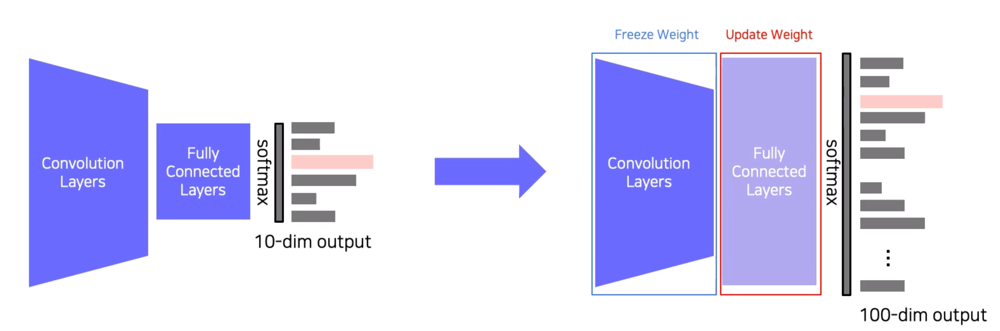
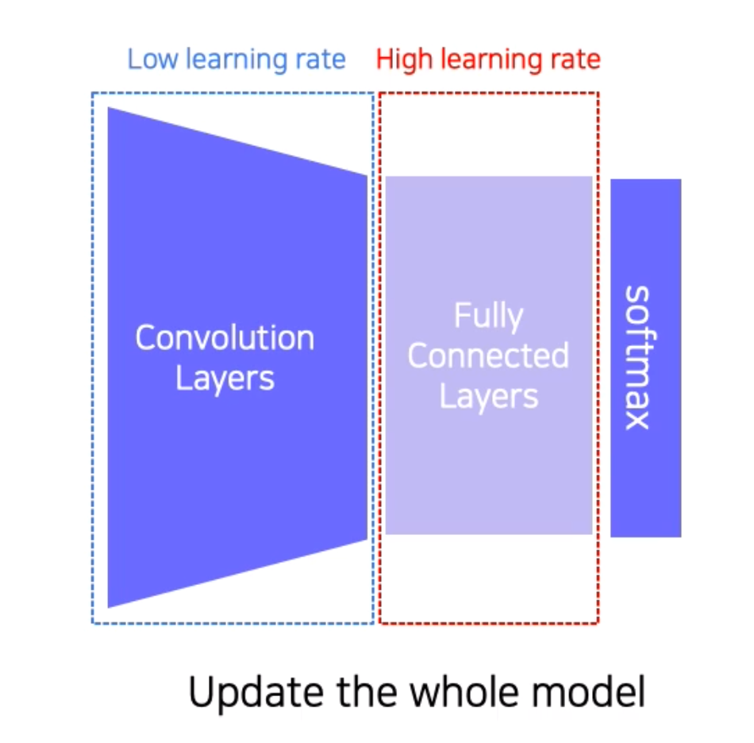
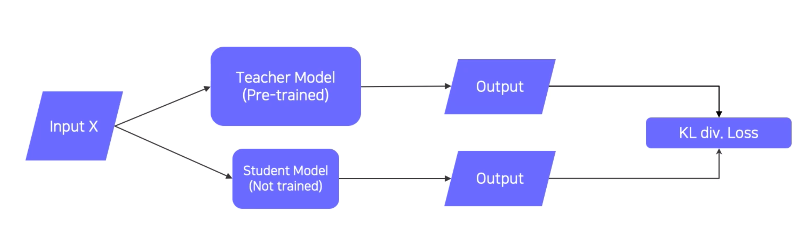
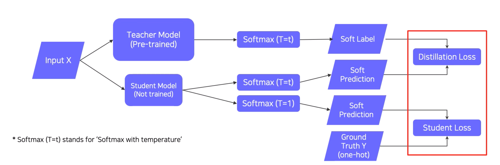

# Data Augmentation
## Learning Representation of Dataset
- neural networks learn compact features of a dataset
- images taken by camera are not equal to real data
- the training dataset if sparse samples of real data
- augmenting data to fill more space and to close the gap
## Data Augmentation
- appluing various image transformations to the dataset
  - crop, shear, brightness, perspective, rotate, and so on
- OpenCV and NumPy have various methods useful for data augmentation
- `goal: make training dataset's distribution similar with real data distribution`
## Various Data Augmentation
- various brightness in dataset
  ```Python
  def brightness_augmentation(img):
      # img -> numpy array
      # img has RGB value(0-255) for each pixel
      for i in range(3):
          img[:,:,i] = img[:,:,i]+100
        
      for i in range(3):
          img[:,:,i][img[:,:,i]>255] = 255
        
      return img
  ```
- rotating image using OpenCV
  ```Python
  import cv2

  img_rotated = cv2.rotate(image, cv2.ROTATE_90_CLOCKWISE)
  img_rotated = cv2.rotate(image, cv2.ROTATE_180)
  ```
- cropping image using NumPy
  ```Python
  y_start = 500
  crop_y_size = 400
  x_start = 300
  crop_x_size = 800
  img_cropped = image[y_start:y_start + crop_y_size, x_start:x_start + crop_x_size,:]
  ```
- affine transformation(shear) using OpenCV
  ```python
  rows, cols, ch = image.shape
  pts1 = np.float32([[50, 50], [200, 50], [50, 200]])
  pts1 = np.float32([[10, 100], [200, 50], [100, 250]])
  M = cv2.getAffineTransform(pts1, pts2)
  shear_img = cv2.warpAffine(image, M, (cols, rows))
  ```
## Modern Augmentation Techniques
- cut mix
  - mixing both images and labels
- RandAugment
  - many augmentation methods exist. hard to find the best to apply
  - automatically finding the best sequence of augmentations to apply
    - identity
    - autoContrast
    - equalize
    - rotate
    - solarize
    - color
    - posterize
    - contrast
    - brightness
    - sharpness
    - shear-x
    - shear-y
    - translate-x
    - translate-y
# Leveraging Pre-trained Information
## Transfer Learning
- supervised learning requires a very large-scale dataset for training
- annotating data is very expensive and its quality is not ensured
- transfer learning: a practical training method with a small dataset
- the assumption
  - knowledge learned from one dataset can be applied to other datasets
- approach1:
  - transfer knowledge from a pre-trained task to a new task
  
- approach2:
  - fine tuninh the whole model
  
## Knowledge Distillation
- teacher-student network structure
  
  
# Leveraging Unlabeled Dataset for Training
## Semi-supervised Learning
## Self-training