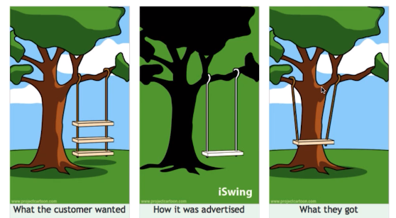

# 1.Light Model
## 1.1. Mini code
### 1.1.1. mini code 1: object in memory
```python
# python 3.6.X
# python --version
a = 256
print(a == 256)     # True
print(a is 256)     # True

b = 257
print(b == 257)     # True
print(b is 257)     # False

# What is the difference between == and is?


import sys

print(sys.getsizeof(0))         # 24
print(sys.getsizeof(1))         # 28
print(sys.getsizeof(2**30-1))   # 28
print(sys.getsizeof(2**30))     # 32
print(sys.getsizeof(2**60-1))   # 32
print(sys.getsizeof(2**60))     # 36
print(sys.getsizeof(2**90-1))   # 36
print(sys.getsizeof(2**90))     # 40
print(sys.int_info)
# sys.int_info(bits_per_digit=30, sizeof_digit=4)
```
### 1.1.2. mini code 2: python bytecode reverse assembler
> code 1
```python
import dis
def add(a, b):
    c = a + b
    return c
r = add(10, 20)
print(r, add.__code__.co_varnames)
dis.dis(add)
```
> result 1
```
30 ('a', 'b', 'c')
  3           0 LOAD_FAST                0 (a)
              2 LOAD_FAST                1 (b)
              4 BINARY_ADD
              6 STORE_FAST               2 (c)

  4           8 LOAD_FAST                2 (c)
             10 RETURN_VALUE
```

> code 2
```python
import dis
def add(a, b):
    return a+b
r = add(10, 20)
print(r, add.__code__.co_varnames)
dis.dis(add)
```
> result 2
```
30 ('a', 'b')
  3           0 LOAD_FAST                0 (a)
              2 LOAD_FAST                1 (b)
              4 BINARY_ADD
              6 RETURN_VALUE
```
> code 3
```python
print(4 != 0 not in [1, 2, 3])
print((4 != 0) not in [1, 2, 3])
print(4 != 0 not in [0, 1, 2, 3])
print((4 != 0) n
ot in [0, 1, 2, 3])
```
> result 3
```
True
False
False
False
```

> code 4
```python
import dis
dis.dis('print((4 != 0) not in [0, 1, 2, 3])')
```
> result 4
```
  1           0 LOAD_NAME                0 (print)
              2 LOAD_CONST               0 (4)
              4 LOAD_CONST               1 (0)
              6 COMPARE_OP               3 (!=)
              8 LOAD_CONST               2 ((0, 1, 2, 3))
             10 COMPARE_OP               7 (not in)
             12 CALL_FUNCTION            1
             14 RETURN_VALUE
```


## 1.2. Main theme
### 1.2.1. decision making
- deductive decision
  1. all men are mortal
  2. I am a man
  3. therefore, I am mortal

- inductive decision
  - all DL model(training and inference)


### 1.2.2. decision making machine
- machine that makes decision
- all things in the real world are not decidable
- the importance of each stuff varies widely
  - recommendation is said to be less critical than stock trading
- chain of value
  1. virtue
  2. diagnosis
  3. evaluation
  4. decision(ex. moving, reasoning and so on)


# 2. Salable Product
## 2.1. Mini code
### 2.1.1. mini code: system resource monitoring
```
top
nvidia-smi
watch -n 0.5 nvidia-smi
vmstat -h
htop
sensors
atop
mpstat
sar 3
sar 3 4
```
## 2.2. Main theme
### 2.2.1. forward and backward
- development based on customer's needs
  
- if the product is not worth enough to make, how excellent developers are has no meaning 
- 
### 2.2.2. on AI
### 2.2.3. on-device AI
### 2.2.4. case: on-device AI solution
## 2.3. Toy code
### 2.3.1 toy code: not enough resource